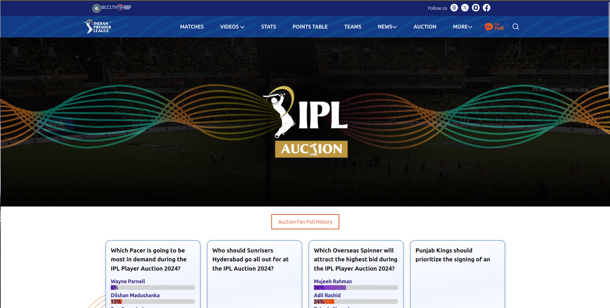
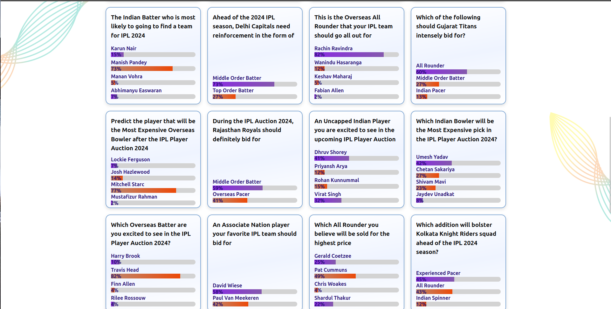
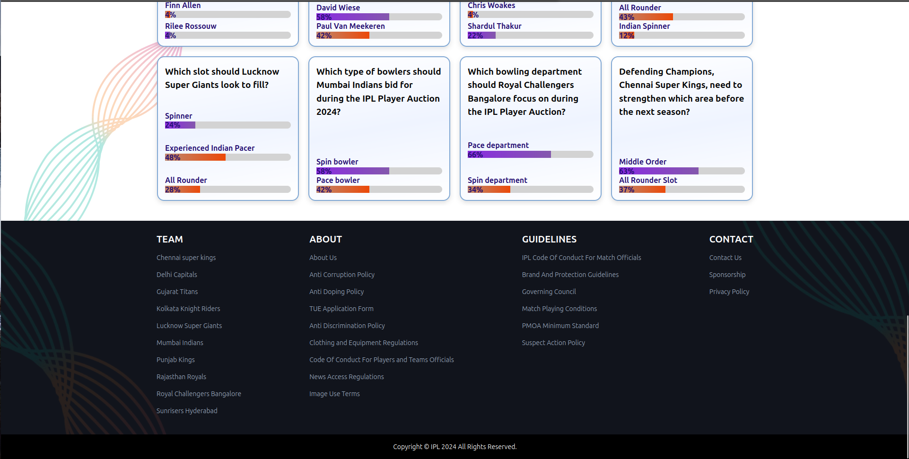

<h1><b>IPL Fan Poll Page<b/><h1> 
<b>INTRODUCTION:<b/> 
This webpage is about the upcoming IPL Player Auction. It discusses which players fans are excited to see and which teams need the most reinforcement. 
<b>TECHNOLOGIES:</b> 
<b>1.HTML</b> 

HTML is a programming language which is used for structuring web Pages including headers, navigation bars, content sections, and footers.
  
<b>CSS 
Applied for styling and layout with different CSS properties </b> 
<b>TailWind Css</b> 

FrameWork of css
 
<h2>Accessing the Help Page</h2>

## CHALLENGES 

#### 1. CONSISTENCY
<ol> Maintaining consistency in coding styles, naming conventions, and overall structure is crucial. </ol>

#### 2. VERSION CONTROL
<ul> Handling version control with tools like Git helps prevent conflicts and allows for collaboration, but it requires careful management to avoid code conflicts. </ul>

#### 3. BROWSER COMPATIBILITY
<ul> Ensuring the website functions correctly across different browsers can be challenging due to varying levels of support for HTML, CSS, and JavaScript features.
 </ul>

#### 4. RESPONSIVENESS
<ul>  Creating a responsive design that works well on different devices and screen sizes requires careful planning and testing. </ul>

#### 5. TESTING AND DEBUGGING
<ul>Rigorous testing and debugging are necessary to identify and fix issues promptly </ul>

## CONCLUSION
Thank you for exploring the Adidas Help page and the Men's page in this repository. Each page is designed responsively, ensuring a seamless experience across devices. Built with HTML and CSS, these pages deliver intuitive and informative content. 

#### Achievement:

<ul><li>Learning and Skill Development:</ul> <ul>This project has been a valuable learning experience in web development.
We've honed our skills in HTML and CSS allowing us to create responsive and visually appealing web pages.</ul>

